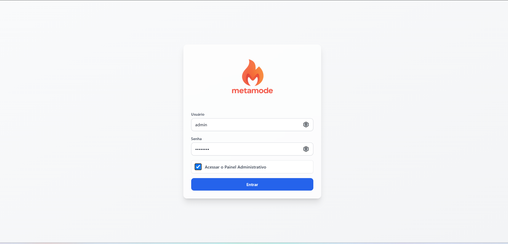
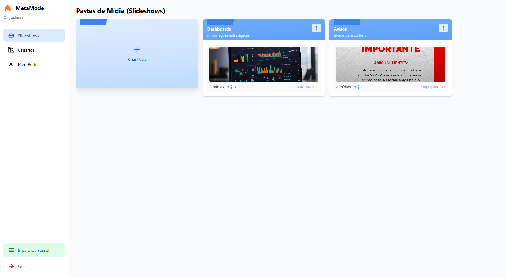
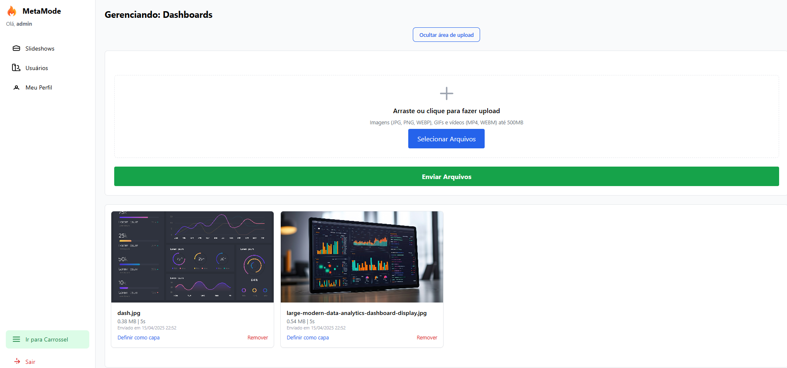
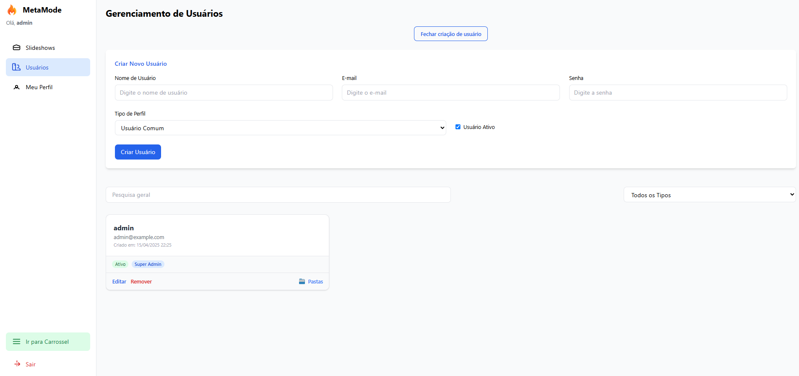
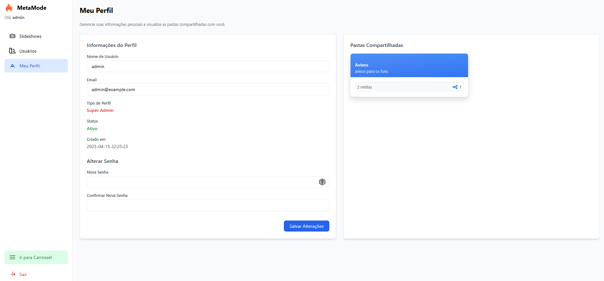

# 🔥 Metamode

**Metamode** é uma plataforma open-source para organização e exibição de mídias em ambientes empresariais. Desenvolvido com foco em usabilidade, escalabilidade e controle de permissões, o sistema é ideal para uso em TVs de recepção, dashboards internos, campanhas institucionais e informativos para colaboradores.

---

## 🌐 O que é o Metamode?

O **Metamode** é um sistema web completo para:

- Upload de imagens, vídeos e banners (PNG, JPG, WEBP, MP4, WEBM, etc)
- Organização em *slideshows* (pastas de mídia)
- Carrossel de exibição automática com duração configurável
- Controle de acesso por usuário ou grupo
- Painel administrativo com permissões gerenciáveis
- Visual responsivo para TV, desktop e tablets

---

## 🎨 Telas do Sistema

### Tela de Login


### Painel de Pastas de Mídia


### Upload de Arquivos


### Gerenciamento de Usuários


### Perfil de Usuário

---

## 🏋️ Público-Alvo

- Franquias com painéis informativos
- Equipes de marketing e comunicação interna
- Empresas que utilizam dashboards de BI
- Recepções corporativas

---

## ⚖️ Funcionalidades

| Função                        | Descrição                                                                 |
|-------------------------------|---------------------------------------------------------------------------|
| Carrossel Automático          | Exibe mídias em sequência com tempo configurável                         |
| Controle por Pasta (Slideshow)| Cada grupo de mídias é isolado por permissão                            |
| Upload Drag-and-Drop          | Uploads via cliques ou arraste, com limite configurável em MB             |
| Permissões Granulares         | Controle por ações: criar, editar, deletar, definir capa, etc.           |
| Logs e Sessões                | Sessões seguras com tempo de expiração e registro em arquivo            |

---

## 🗄️ Suporte a Múltiplos Bancos de Dados

O Metamode oferece **suporte nativo** para dois tipos de banco de dados:

- **🐬 MySQL/MariaDB** - Ideal para ambientes tradicionais
- **🐘 PostgreSQL** - Recomendado para novos projetos

### 📁 Configuração Simplificada

Escolha o arquivo `.env` apropriado:

```bash
# Para MySQL/MariaDB
cp .env.mysql.example .env

# Para PostgreSQL  
cp .env.postgresql.example .env
```

---

## 🚀 Comece Agora

Escolha um dos guias de instalação:

- ✅ [Guia de Instalação Rápida (Linux/Windows)](docs/INSTALL_DEV.md)
- 🏗️ [Guia de Instalação para Produção](docs/INSTALL_PROD.md)

---

## 📚 Tecnologias Utilizadas

- **Backend**: FastAPI, SQLAlchemy 2.0
- **Frontend**: HTML, TailwindCSS, JavaScript puro
- **Banco de dados**: MySQL/MariaDB **OU** PostgreSQL (suporte dual)
- **Deploy**: Gunicorn, NGINX, Certbot (SSL), UFW, Systemd

---

## 📂 Estrutura de Diretórios (resumo)

```
metamode/
├── src/backend              # FastAPI, rotas, serviços, models
├── src/frontend             # HTML, JS, CSS (Tailwind)
├── scripts/                 # Seeds de permissão e usuários
├── uploads/                 # Diretório gerado para mídias
├── logs/                    # Logs rotativos automáticos
├── .env.example             # Configuração genérica
├── .env.mysql.example       # Configuração para MySQL/MariaDB
├── .env.postgresql.example  # Configuração para PostgreSQL
└── README.md                # Este arquivo
```

---

## 📄 Licença

Distribuído sob a licença MIT. Livre para uso comercial, pessoal ou institucional.